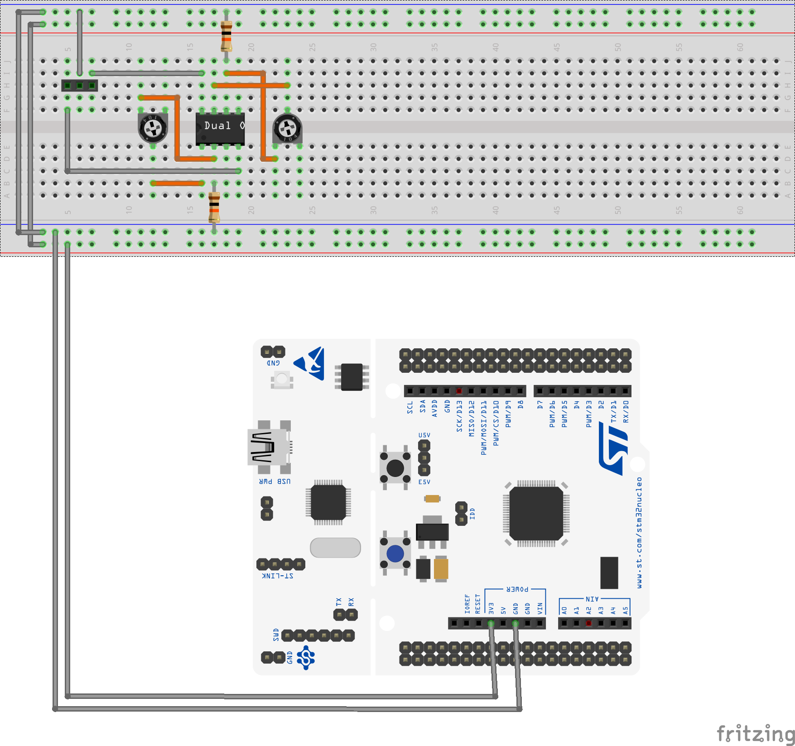

# Instrukcja  konstrukcji urządzenia MusiqueBox

MusiqueBox jest urządzeniem towarzyszącym dla języka Musique. Może zapewnić on kontrolki do użycia w języku - przykładowo pokrętła, których wartość można odczytać w języku, a ich stany użyć w kodzie. Urządzenie to może również pozwolić na sterowanie instrumentami obsługującymi Control Voltage przez język.

MusiqueBox jest otwarty jak reszta projektu Musique - posiadając umiejętności programistyczne można go modyfikować dla własnych potrzeb. W tym poradniku opisana zostanie konstrukcja urządzenia posiadającego dwa pokrętła oraz trzy przyciski przekazujące swoje stany do interpretera Musique, oraz posiadającego 2 wyjścia analogowe i jedno 2-stanowe cyfrowe do obsługi urządzenia sterowanego przez CV - jednak zależnie od potrzeb użytkownika, część z tych rzeczy można pominąć a urządzenie wciąż będzie działać.

Do zbudowania przynajmniej podstawowej wersji urządzenia potrzeba podstawowej umiejętności łączenia komponentów elektronicznych na płytce stykowej, oraz rozpoznawania wyprowadzeń w podstawowych komponentach elektronicznych i układach scalonych. Do budowy układu do obsługi urządzeń sterowanych napięciem zalecane jest jednak posiadanie większego doświadczenia z elektroniką.

## Wymagane komponenty

Urządzenie MusiqueBox bazuje na chwilę obecną na płytce rozwojowej STM32 NUCLEO L476-RG. Płytka ta jest programowalna z poziomu komputera osobistego przez złącze USB, oraz posiada wygodnie wyprowadzone piny do podłączenia komponentów. Bazowe elementy potrzebne do zbudowania urządzenia to:
- płytka rozwojowa STM32 NUCLEO L476-RG
- przewód USB/Mini USB pozwalający podłączyć urządzenie do komputera z intepreterem
- płytka stykowa oraz przewody połączeniowe do podłączenia komponentów składających się na urządzenie

Kontrolki do sterowania wartościami w Musique mogą być dobrane przez użytkownika. Na rzecz tego poradnika przedstawimy sposób konstrukcji urządzenia z trzema przyciskami i dwoma pokrętłami, ale możliwe jest podłączenie innych rodzajów podstawowych kontrolek. Przykładowo można zastąpić pokrętła suwakami - obie z tych rzeczy zwykle działają w oparciu o potencjometr, więc je można podłączyć do urządzenia analogicznie do siebie. Do zbudowania kontrolek dla tego projektu należy zaopatrzyć się w:
- 3x mikroprzełącznik z pinami do montażu na płytce stykowej
- 2x potencjometr o maksymalnym oporze 100kΩ
- 2x rezystor o oporze 220kΩ

Aby urządzenie rozszerzyć o układ sterujący instrumentem sterowanym CV, potrzebne będą również:
- wzmacniacz operacyjny TL072CP (lub podobny) w obudowie DIP-8
- 2x potencjometr montażowy o maksymalnym oporze 10kΩ
- 2x rezystor o oporze 10kΩ
- złącza i przewody odpowiednie do wyprowadzenia napięć sterujących do instrumentu, oraz podłączenia zasilania instrumentu do MusiqueBoxa 
    - dla syntezatorów modularnych typu Eurorack (oraz wielu innych instrumentów sterowanych CV) będą to złącza Minijack TS, aczkolwiek w tym przykładzie złącza będą przedstawione jako rzędy pinów - 3 dla zasilania, oraz 3 dla napięć sterujących
    - potrzebna jest możliwość wyprowadzenia napięć dodatniego i ujemnego, ale również uziemienia z intrumentu muzycznego

## Konstrukcja urządzenia
MusiqueBox bazuje na chwilę obecną na płytce rozwojowej STM32 NUCLEO L476-RG. Stanowi ona centralny element urządzenia; mikrokontroler na płytce jest łatwo programowalny przez zapewniane przez producenta programy komputerowe. W celu konstrukcji MusiqueBoxa należy tę płytkę zaprogramować, a następnie podłączyć odpowiednie układy do portów na płytce.

### Programowanie płytki NUCLEO
W pierwszej kolejności do działania MusiqueBoxa należy zaprogramować płytkę NUCLEO na której urządzenie bazuje...
[TODO]

### Podłączenie układów do płytki

Powyższy rysunek ilustruje sposób konstrukcji odpowiednich układów na płytce stykowej i podłączenia ich do płytki rozwojowej NUCLEO. W repozytorium zamieszczony jest również schemat elektroniczny urządzenia. 

W ramach tego poradnika konstrukcja przedstawiona będzie głównie w postaci jak rysunek powyżej. 

Duża część z wyprowadzeń na płytce NUCLEO ma więcej niż jedno oznaczenie - jeden rodzaj oznaczeń odpowiada oznaczeniom portów na mikrokontrolerze STM32L476RG, a drugi odpowiada oznaczeniom obecnym na płytkach rozwojowych Arduino UNO. Na zawartych w tym poradniku infografikach zastosowane są oznaczenia odpowiadające Arduino UNO i opisy słowne również odnoszą się do tej wersji oznaczeń.

### Układ wejścia
W chwili obecnej program MusiqueBoxa zapewnia wsparcie dla maksymalnie trzech przycisków, oraz maksymalnie dwóch pokręteł analogowych. Możliwe jest podłączenie mniejszej ilości kontrolek.

Każdy z przycisków należy podłączyć przez połączenie jednego z wyprowadzeń z masą (wyprowadzenie GND na płytce), a drugiego - do odpowiedniego wyprowadzenia cyfrowego. Do podłączenia przycisków na płytce dostępne są wyprowadzenia D7, D8 oraz D11.

<figure>
    
    <figcaption>Krok 1.  Podłączenie przycisków do masy</figcaption>
</figure>

<figure>
    
    <figcaption>Krok 2.  Podłączenie przycisków do wyprowadzeń cyfrowych</figcaption>
</figure>

Aby podłączyć do urządzenia potencjometr, jedno z jego skrajnych wyprowadzeń należy podłączyć do masy, a drugie - szeregowo poprzez rezystor 220kΩ - do styku 3V3 na płytce NUCLEO. Środkowe wyprowadzenie potencjometru należy podłączyć do jednego z dwóch dostępnych wejść analogowych - są to piny oznaczone jako A4 i A5.

<figure>
    
    <figcaption>Krok 3.  Podłączenie potencjometrów do masy</figcaption>
</figure>

<figure>
    
    <figcaption>Krok 4.  Podłączenie potencjometrów do napięcia 3V</figcaption>
</figure>

<figure>
    
    <figcaption>Krok 5.  Podłączenie potencjometrów do wyprowadzeń analogowych</figcaption>
</figure>

### Układ sterujący CV

Pospolite instrumenty sterowane napięciem zasilane oraz sterowane są napięciami z zakresu 0 do 12V. W celu zapewnienia takich napięć na wyjściu MusiqueBoxa konieczne jest zastosowanie wzmacniacza operacyjnego aby odizolować napięcia na płytce rozwojowej od napięć instrumentu, oraz aby rozszerzyć zakres napięć wyjściowych. 

Konstrukcja tego układu wygląda następująco:

<figure>
    
    <figcaption>Schemat wzmacniacza</figcaption>
</figure>

Sugerowane jest zastosowanie układu TL072CP, składającego się z dwóch zintegrowanych wzmacniaczy operacyjnych. W celu konstrukcji układu sterowania CV należy wyprowadzić piny 4 oraz 8 - odpowiednio napięcie negatywne i pozytywne - na zewnętrzne porty. Są to piny zasilające wzmacniacz, i muszą zostać one podłączone później do zasilania **instrumentu** w celu prawidłowego działania. Wyprowadzić należy również na podobny port masę MusiqueBoxa - musi ono zostać sparowane z masą instrumentu.

<figure>
    
    <figcaption>Krok 1.  Wyprowadzenie pinów zasilania</figcaption>
</figure>

<figure>
    
    <figcaption>Krok 2.  Wyprowadzenie masy</figcaption>
</figure>

Piny 2 i 6 układu TL072CP należy podłączyć do masy rezystorami 10kΩ, oraz każdy z nich podłączyć również przez potencjometr montażowy 10kΩ - odpowiednio do pinów 1 oraz 7 tego samego układu. Piny 1 oraz 7 będą również wyjściami napięcia sterującego, należy je wyprowadzić na porty zewnętrzne, podobnie do portów zasilania omówionych nieco wyżej. Napięcie sterujące będzie kontrolowane przez piny A2 oraz D13 na płytce NUCLEO. Te dwa wyprowadzenia należy zewrzeć odpowiednio z pinami 3 oraz 5 wzmacniacza. Napięcie wyjściowe będzie odpowiadało napięciom na tych pinach, ale będzie wzmocnione i odizolowane od instrumentu przez wzmacniacz. 

<figure>
    
    <figcaption>Krok 3.  Rezystory 10kΩ</figcaption>
</figure>

<figure>
    
    <figcaption>Krok 4.  Potencjometry montażowe 10kΩ</figcaption>
</figure>

<figure>
    
    <figcaption>Krok 5.  Wyprowadzenie pinów z napięciem sterującym</figcaption>
</figure>

<figure>
    
    <figcaption>Krok 6.  Podłączenie pinów sterujących z płytki</figcaption>
</figure>

Wzmocnienie napięcia przez wzmacniacz w powyższym układzie kontrolowane jest przez potencjometry montażowe - zależnie od oporu przez nie ustawionego, zakres napięć można zwiększyć maksymalnie do 10V, ale nie powyżej napięcia zapewnionego przez instrument. Po montażu urządzenia i wgraniu oprogramowania, należy je podłączyć do instrumentu i w razie potrzeby doregulować opór potencjometrów, tak, aby odpowiednio nastroić urządzenie.

Dodatkowo, aby grać instrumentem sterowanym napięciem potrzebny jest cyfrowy sygnał GATE. W naszej implementacji sygnał GATE obsługiwany jest bezpośrednio przez pin D12 płytki i również należy go wyprowadzić na zewnętrzny port.

<figure>
    
    <figcaption>Krok 7.  Wyprowadzenie pinu GATE</figcaption>
</figure>